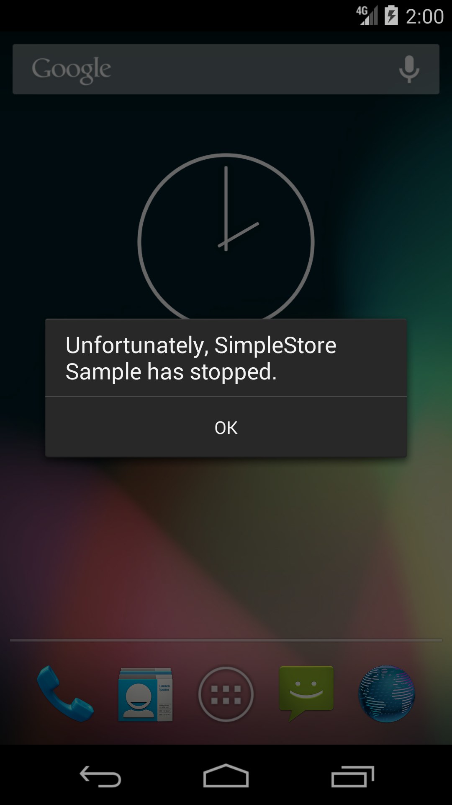
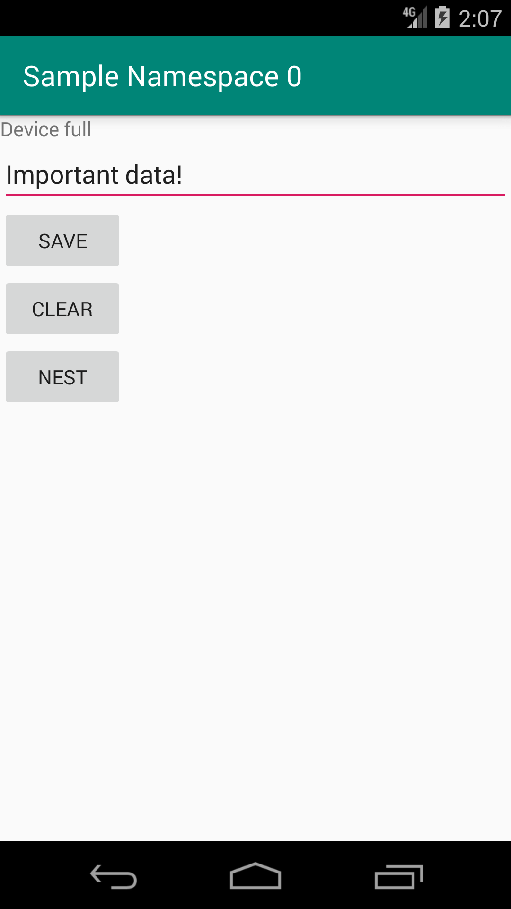
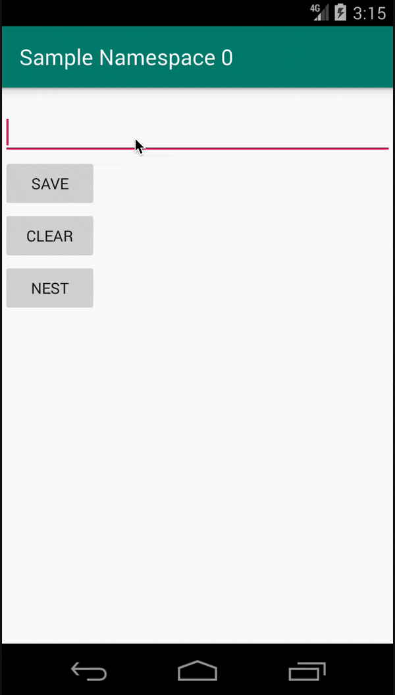

theme: Plain Jane, 3

# Storing app data reliably, performantly and easily

<br>

Kurt Nelson
Mobile Platform at Uber

[.header: alignment(left), text-scale(1.5)]
[.autoscale: true]

^ Hi! I'm Kurt and I work at Uber on the mobile platform team. Our job is to make mobile developer's jobs easier while improving the quality of our apps. I used to do a very similar job at Google, and I'm here to talk about something I have worked on at both companies.

---

# Last time at DroidconSF...

---

### Last time at DroidconSF...

# The Dangers of SharedPreferences

---

# SharedPreferences

### It's still in the framework, and still kind of works.
### Still avoided by both Uber and Google

---

# Apps written at Uber, Google & Facebook are deployed at scale.

^ App written at companies like Uber, Google, and Facebook have multiple apps used by millions (or billions) of users daily. We use the term "at scale" when talking about the parts of our development process that ensure we maintain our user experience.

---

# When working on an app "at scale", there are some extra issues you have to worry about.

^ When you have tons of users, you'll see all of the edge cases you might normally brush off.

---

# [fit] Storage at Scale

^ Let's talk about the concerns we have when storing data on disk, and then offer a solution that helps with these problems both at scale and in your hobby app.

---

# What is storage at scale?

## Performing I/O operations on millions of devices, millions of times a day, globally.

^ Being successful 99.9% of the time is no longer good enough. “Edge cases” become regular cases. Binaries live in the wild for months or years without getting updated, not all your customers are on flagship devices

---

---

# [fit] Storage Reliability

---

# Why is storage reliability important?

---

# Storage errors should not crash the user



^ Applications should not crash due to a storage error

---

# Storage Reliability

### Applications need to know when IO fails in a timely manner

^ A reliable framework will deliver either a success or a failure callback 100% of the time.

---

# Async callbacks improve the user experience

^ Callbacks improve the user experience because you get to choose when to block the UI on an operation.

---

# Explain fixable errors to the user

### When `SharedPreferences#apply()` fails, you never find out

^ If saving a login token fails because the disk is full, tell the user!

---

# Storage Reliability

[.code-highlight: all]
[.code-highlight: 4, 7]

```java
SharedPreferences sharedPref = context.getSharedPreferences("app", Context.MODE_PRIVATE);
SharedPreferences.Editor editor = sharedPref.edit();
editor.putString("auth_token", authToken);
editor.apply();

context.startActivity(MainScreenActivity.class);
finish();
```

^ Here is example code for storing something via Shared Preferences. This is could that could very easily be part of your login process. But it has two bugs. If apply fails to write to disk, the user will be mysteriously logged out if you application is restarted. Additionally if the write is not immediate, the finish() will block the main thread on it completing.

---

# Block progress on failure when appropriate

### Essential for legal and privacy status, such as a EULA or GDPR opt-out.

^ Kicking your user out of the app due to an error is unpleasant, losing money is bad.

---

# [fit] Storage Performance

---

# Why is storage performance important?

---

## The user experience should always be smooth.

## Storage can cause frame drops.

---



---


---

# It is easy to drop frames

Running at 60fps gives the device 16 milliseconds to render each frame.

Even on a modern device, the p95 storage read latency is already in this neighborhood. On low end devices, this can be drastically slower.

---

# Storage Performance

## Different types of data have different performance needs.

---

# Cache Performance Optimizations

If a cache read is latent, maybe it should be eagerly treated as a miss?

If a cache write fails, does anyone care?

^ Storage operations should be treated similarly to networking ops, they can similarly randomly fail or be latent.

---

# Storage Performance

## Critical disk operations should block progress with a spinner until complete

^ You don't want a user stuck on a spinner forever.

---

# [fit] API Ergonomics

---
[.build-lists: true]

# API Ergonomics

* Understandable by new developers

^ A new dev needs to be able to use the API intuitively, but an advanced user needs to be able to tune the performance.

* Common async abstraction

^ Rx is the de-facto standard for async behavior on Android, followed by ListenableFuture (especially in Google code). Callbacks are another common pattern in java. Whatever async API is chosen, it needs to be able to easily handle success and error state callbacks.

* Using correctly is easy

^ Doing the right thing must be the easy way to use it.

^ If an API can be built so the calling thread does not matter, that is a great thing. Blocking the UI thread should require suppressing analysis.

* Consistant behavior for primitives and objects
* Future proof serialization

^ The on-disk format must be flexible enough to support upgrading a binary and having new fields.


---

# [fit] I want a key-value store that ensures all of this.

---

# [fit] I want a key-value store that ensures all of this.
# So I built it. Twice.

---

---

# [fit] SimpleStore

### Simple yet performant asynchronous file storage for Android

---

# SimpleStore

https://github.com/uber/simple-store

[.text: alignment(center)]

---

# Write a key

[.code-highlight: all]
[.code-highlight: 1]
[.code-highlight: 2, 15]
[.code-highlight: 3, 6, 7, 10]
[.code-highlight: 4]
[.code-highlight: 13]
[.code-highlight: all]

```kotlin
val store = SimpleStoreFactory.create(context, MY_NAMESPACE)
store.use {
  Futures.addCallback(
    it.putString("key", "value"),
    object : FutureCallback<String> {
      override fun onSuccess(result: String) {
        // update the UI
      }

      override fun onFailure(t: Throwable) {
        Log.e("MyActivity", "Something went wrong", t)
      }
    }, mainExecutor()
  )
}
```

---

# Namespaces

A namespace is the base unit that can be opened and closed.

Only one reference to a specific namespace is allowed to exist at a time.

Ordering is guarenteed within a namespace.

^ Namespaces allow us to be performant while still having an API that is easy to understand the threading properties of.

---

# Write a key (RxJava)

```kotlin
SimpleStoreFactory.create(context, MY_NAMESPACE).use {
  Single.fromFuture(it.putString("some_key", "Foo value"))
      .observeOn(uiThread())
      .subscribe(updateView, handleError)
}
```

---

# Fetch a key (RxJava)

```kotlin
SimpleStoreFactory.create(context, MY_NAMESPACE).use {
  Single.fromFuture(simpleStore.getString("some_key"))
      .observeOn(uiThread())
      .subscribe(updateView, showError)
}
```

---

# Design Principles

1. Fundamentally async
1. Never emits null
1. Serializes as a `byte[]`
1. Releases all resources when desired
1. Supports configuring based on data type

---

# Fundamentally Async

## IO operations are interrupt driven.

---

# Fundamentally Async

## Shared thread pool to enqueue IO operations across all callsites
## Internally uses `OrderedExecutor`

^ When the consumer is done with the store, they call close which prevents new operations from being enqueued and allows existing operations to complete.

---

# Why not RxJava?

## `Single.fromFuture` instantly goes from ListenableFuture to RxJava.

^ `ListenableFuture` is already used internally by many Google dependencies, and Play Services is considering moving to it from their custom Task.

^ ListenableFuture uses standard java executors which are easy to understand. Rx schedulers have nuance that can lead to issues with highly parallel I/O. (See Utkarsh + Yohan's DCSF18 threading talk)

---

# Never Emits Null

## `null` in an Rx-stream or `ListenableFuture` is undesirable
## 0-length `byte[]` equivalent of the value instead

^ This means many common use cases such as a counter never need a null-check. If presence is important for a use case, a boolean isPresent can be stored along side the payload key.

---

# Serializes to byte[]

## Base class only handles `String` and `byte[]`
## Allows choosing your own object serialization

^ In a JVM-world, serializing to `byte[]` is performant. Using a built-in primitive instead of JSON or XML eliminates parsing and metadata overhead.

^ Using `byte[]` also unlocks easily layering a format such as Protocol Buffers or flatbuffers on top. The core class of SimpleStore only has methods for `byte[]` and `String`, keeping the core library light weight.

---

# [fit] Releases Resources

## After `close()` is called, SimpleStore releases the in-memory cache.

---

# Releases Resources

## When a namespace is closed, resources are freed
## Optional LRU mode for in-memory cache

^ If an activity is destroyed by the OS, the in-memory cache can easily go away with it. Singletons are still a valid pattern if a key is needed across the entire lifespan of the process.

^ For any storage object, it generally doesn't need to stay in memory longer than the feature

---

# [fit] Supports Configurations

## Caches
## Non-critical
## Critical
## The Next New Thing

---

# Supports Configurations

## When opening a namespace, an optional configuration can be passed.

## Used to place on disk

^ Currently `NamespaceConfig` works like an enum, but can be turned into a builder pattern as features are added.

---

# Supports Configurations

## Cache

```java
SimpleStoreFactory.create(context,
  "<namespace>",
  NamespaceConfig.CACHE)
```

In the future, we can optimize memory use for you.

^ Android has a separate cache partition that the OS can wipe at will.

---

# Supports Configurations

## Non-critical

```java
SimpleStoreFactory.create(context, "<namespace>")
```

Default mode, good for data that is not on a hot-path.

---

# Supports Configurations

## Performance Critical

```java
SimpleStoreFactory.create(context,
  "<namespace>",
  NamespaceConfig.CRITICAL)
```

Keeps data in memory as long as the store is open

^ Good for authentication tokens or other global widely-used state.

---

# Supports Configurations

## The Next New Thing

Android Q's media scoping can be implemented down the line.

---

# Primitives are in the box

If you want to store more than just `String` and `byte[]`, `PrimitiveSimpleStore` implements basic serialization of primitives for you.

^ Modularity was a guiding principle here, if you have an arbitrary on-wire format, you can wrap that.

---

### If you're only interested in storing primitives, you can leave the talk now.

---

# [fit] More than primitives!

---

# SimpleStore for Protocol Buffers

Companion artifact of `simplestore-proto` enables storing protoc generated POJOs directly.

Atomically load complex models from disk.

gRPC users are already using protos for models.

Uses Google's Lite protoc plugin, contibutions of other runtimes welcome.

---

```kotlin
val proto = Demo.Data.newBuilder().setField(editText.text.toString()).build()
Futures.addCallback(
   simpleStore.put("some_thing", proto),
   object : FutureCallback<Demo.Data> {
     override fun onSuccess(s: Demo.Data?) {
       editText.setText("")
       button.isEnabled = true
       editText.isEnabled = true
       loadMessage()
     }

     override fun onFailure(t: Throwable) {
       textView.text = t.toString()
       button.isEnabled = true
       editText.isEnabled = true
     }
   },
   mainExecutor()
)
```

---

# [fit] Modular & flexible.

## Use whatever serialization format you like.

---

# Possible Enhancements

* Co-routine wrapper

* Kotlin native compatible interface

^ Uses Java's file APIs under the hood.

* Automatic cache eviction

^ Right now cache mode keeps everything in memory while in scope.

* Pipelining within a namespace

^ Reads on clean keys can operate in parallel

* Key auditing & cleanup

^ Using static analysis to track what namespaces are used in a binary and automatically clean up old ones.

---

# [fit] Contributions welcome!

---

# [fit] Thanks!

## Kurt Nelson, Uber Mobile Platform
## @kurtisnelson
## http://github.com/uber/simple-store
